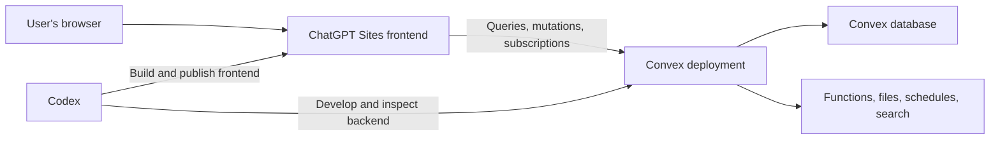
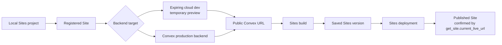

# ChatGPT Sites + Convex

Build and ship a [ChatGPT Site](https://learn.chatgpt.com/docs/sites?surface=app) with [Convex](https://www.convex.dev/) as its realtime database and backend using one reusable Codex skill.

> **Quick start:** Install the skill, restart Codex, then prompt: `$codex-sites-convex Build and publish a durable shared realtime project tracker for my team.` Publishing or sharing uses Convex production by default and returns a live Sites URL.

> **Optional live example:** [Open Daymark Todo](https://daymark-todo.waynesutton.chatgpt.site/). It demonstrates a public, shared realtime list powered by ChatGPT Sites and Convex, with a Convex cron job that clears Todos every five minutes. [Learn how cron jobs work](https://docs.convex.dev/scheduling/cron-jobs). This demo is not required for installation or use and should not be treated as the default app architecture.

## Why this skill?

ChatGPT Sites and Convex have complementary responsibilities:

- **ChatGPT Sites** creates, builds, publishes, and shares the frontend.
- **Convex** provides the database, queries, mutations, actions, authentication, schedules, search, files, and realtime subscriptions.
- **This skill** makes Codex preserve that boundary, check current official documentation, select appropriate Convex components, validate both halves, and publish in the correct order.

Without a dedicated workflow, an agent can scaffold a second frontend, introduce another database, guess at Convex APIs, skip authorization, expose credentials, or validate only the local UI. This skill adds the missing cross-product runbook.

## What’s included

- A complete build-and-publish workflow in [`SKILL.md`](SKILL.md)
- New-project and existing-project paths
- ChatGPT Sites architecture safeguards
- Current Convex documentation routing
- Official [Convex agent setup](https://www.convex.dev/agent-setup.md) checks for plugin, MCP, and managed AI files
- Official Convex component discovery before implementation
- Component-specific skill loading when a component is selected
- Optional [`convex-helpers`](https://github.com/get-convex/convex-helpers) discovery for matched code-level utilities
- Official [Convex ESLint rules](https://docs.convex.dev/eslint) for backend quality checks
- Convex schema, validator, index, authorization, and pagination rules
- A deployed HTTPS and WebSocket connectivity gate
- Accountless local Agent Mode and isolated cloud-agent guidance
- Expiring Cloud Agent Mode deployments for temporary shared previews
- A backend-readiness gate before Sites or the browser starts
- A Node.js 22.13+ runtime gate, Node 24 project pins, and project-owned `dev`, `build`, and `start` checks
- Expected-port enforcement, exact localhost HTTP verification, and process-lifetime guidance
- Production deployment ordering and Chrome QA
- A removable “Built with ChatGPT Sites + Convex” footer with light and dark theme support and a Phosphor GitHub icon
- Deterministic preflight and project verification scripts

## Architecture



The Convex MCP server helps Codex during development. Visitors use the public Convex React client and generated API types.

The publishing lifecycle is separate from the runtime data flow:



## Four ChatGPT Sites states

| State | Required evidence |
| --- | --- |
| **Local Sites project** | Editable Sites files exist in the current folder |
| **Registered Site** | `.openai/hosting.json` contains a valid nonempty `project_id`, and `get_site` confirms the hosted record; sidebar visibility is checked separately |
| **Saved Sites version** | The current build was uploaded and saved as a version |
| **Published Site** | The saved version deployed successfully, and `get_site.current_live_url` is nonempty and matches the deployment URL |

These states are not interchangeable. A hosting manifest alone does not prove registration, and registration or a saved version does not create a live `.chatgpt.site` URL.

## Accounts, access, and ownership

| Context | Account or key | Can power a published Site? |
| --- | --- | --- |
| Accountless local Agent Mode | No Convex login or deploy key | No; the local backend must keep running on the developer's machine |
| Signed-in developer cloud dev | Saved Convex CLI credentials | Development only unless the user explicitly requests a temporary shared preview |
| Isolated cloud agent dev | Deployment-scoped development key | Yes for a labeled, expiring temporary preview; never production |
| Convex Cloud production | Convex project/account or production-scoped key | Yes |
| ChatGPT Sites visitors | Public access or authorized ChatGPT account | Visitors never need Convex accounts |
| Product authentication | App-specific visitor identity | Controls shared versus per-user data inside the app |

A Convex Pro plan is not required merely to publish. ChatGPT Sites access controls who can open the frontend. Application authentication and Convex authorization control which records a visitor can read or change. See [accounts, access, and ownership](references/accounts-access-and-ownership.md), [Agent Mode](references/agent-mode.md), and [deployment and QA](references/deployment-and-qa.md).

## How Sites and Convex work together

```text
Visitor browser
→ ChatGPT Sites frontend
→ NEXT_PUBLIC_CONVEX_URL
→ Convex Cloud deployment
→ Convex queries, mutations, actions, and data
```

Sites hosts the frontend. Convex hosts durable data and backend functions. `NEXT_PUBLIC_CONVEX_URL` is public configuration that tells `ConvexReactClient` where to connect; it is not a password and does not grant dashboard access. Generated API types describe callable functions, while Convex validators, authentication, and authorization protect backend operations.

## Find your published Site

In the ChatGPT desktop app, open Sites, find the Site, and select it. Open Settings to manage it or Analytics to review unique visitors and page views.

On the web, open [chatgpt.com/sites](https://chatgpt.com/sites), find the Site, select More actions, then choose Settings or Analytics. The Site stays in this list after the original task or conversation ends.

Hosted Sites are managed through ChatGPT on the web or desktop. There is no standalone Codex CLI or IDE management screen.

## Manage Site settings

- **Name:** display name.
- **URL or domain:** hosted `chatgpt.site` address.
- **Custom domain:** a domain or subdomain you already own.
- **Sharing:** who can open the Site; it does not grant edit or Convex-backend access.
- **Environment variables:** hosted frontend or Sites-worker configuration.
- **Analytics:** unique visitors and page views.
- **Delete Site:** permanent and cannot be undone.

Settings can vary by plan, region, workspace policy, and the current Sites beta.

## Environment variables

| Layer | Location | Use |
| --- | --- | --- |
| Local frontend | `.env.local` | Local frontend configuration and local/development Convex URL; keep it out of Git |
| Hosted Sites | Site → Settings → Environment variables | Hosted frontend or server-side Sites-worker configuration |
| Convex deployment | Convex dashboard or CLI environment commands | Backend secrets and configuration used by Convex functions |

Browser-public variables such as `NEXT_PUBLIC_CONVEX_URL` and `VITE_*` are visible to visitors even if a UI offers a Secret switch. Keep `CONVEX_DEPLOY_KEY` and third-party backend secrets out of browser variables. Convex development and production environments are separate, and Convex functions do not read the frontend's `.env.local`.

`.openai/hosting.json` is the local hosting manifest. Its presence alone does not mean the Site is registered. A valid nonempty `project_id`, confirmed with `get_site`, links the local source to the registered Site. The file may also contain logical D1/R2 binding names, but never runtime environment values or secrets. Its `project_id` is a Sites identifier, not a Convex project ID.

## Change the connected Convex deployment

1. Confirm who owns the target Convex project and validate its production deployment.
2. Copy the exact production `convex.cloud` URL.
3. Update `NEXT_PUBLIC_CONVEX_URL` in Site Settings and the production build environment.
4. Rebuild because browser-public values may be embedded in JavaScript.
5. Save and deploy a new Sites version.
6. Confirm the old URL is absent, then test reads, writes, and realtime updates.

Never publish a Site connected to localhost, `127.0.0.1`, or an unintended development deployment. See [Sites settings and environment](references/sites-settings-and-environment.md) for all update runbooks and the full variable reference.

## Public versus private access

`public` lets anyone with the link open the Site without ChatGPT sign-in. `custom`, `workspace_all`, and `admins_only` require the corresponding authorized ChatGPT/OpenAI identity. Changing sharing affects only the Sites visitor gate; it does not deploy Convex, move data, change the Convex plan, or create Convex accounts.

Before making an app public, verify product authentication and per-user Convex authorization. Without them, visitors may share and modify the same records. Public access and any audience expansion require explicit authorization.

## Installation

### Where to paste prompts and commands

- Paste blocks labeled `text` into a Codex task. The task box accepts instructions, not direct shell input. Ask Codex to run a command for you instead of assuming that a raw command was executed.
- Run blocks labeled `bash` in Codex's integrated terminal at the project root, usually the folder containing `package.json`.
- Add blocks labeled `toml` to the named configuration file; do not run them as commands.

For most users, the simplest option is to let Codex run the commands. Ask: `Run the required terminal commands for me from this project root and explain any approval, sign-in, or project-selection request before continuing.`

To run commands yourself, select the terminal icon in the upper-right corner of the Codex app or press `Ctrl` plus the backtick key. The integrated terminal opens for the current project or worktree. Commands such as `npx convex dev` and the Sites development server remain running; keep each in its own terminal session, or ask Codex to manage both processes. See the [integrated terminal guide](https://learn.chatgpt.com/docs/integrated-terminal) and [ChatGPT/Codex docs](https://learn.chatgpt.com/docs).

Before `npm install`, `npx`, or a project script, verify the Node executable selected by that terminal:

```bash
~/.codex/skills/codex-sites-convex/scripts/check-runtime.sh .
```

For a project-local installation, use `./.agents/skills/codex-sites-convex/scripts/check-runtime.sh .`. The Sites starter requires Node.js 22.13.0 or newer; Node.js 24 LTS is recommended. `npm install` installs project dependencies but cannot install or switch the terminal's Node.js runtime. See [local runtime and server](references/local-runtime-and-server.md).

Optional manual mode:

```text
I want to run the commands myself. Show me how to open the Codex integrated
terminal, confirm that it is using this project's root folder, and give me the
commands in the correct order. Explain which commands exit and which development
servers must remain running.
```

If the current task cannot access the project files or run commands, open the project in the Codex desktop app, Codex CLI, or another command-capable Codex environment. Never paste API keys, deploy keys, administrator keys, or other secrets into the task or a browser-public environment variable.

### Option 1: Install for your Codex user

```bash
git clone https://github.com/get-convex/Codex-Sites-Convex-Backend-Skill.git \
  ~/.codex/skills/codex-sites-convex
```

Restart Codex after installation.

### Option 2: Install for one project

From the project root:

```bash
mkdir -p .agents/skills
git clone https://github.com/get-convex/Codex-Sites-Convex-Backend-Skill.git \
  .agents/skills/codex-sites-convex
```

Commit the skill folder if the whole team should use the same workflow.

### Option 3: Copy an existing checkout

User-wide:

```bash
cp -R codex-sites-convex ~/.codex/skills/codex-sites-convex
```

Project-local:

```bash
mkdir -p .agents/skills
cp -R codex-sites-convex .agents/skills/codex-sites-convex
```

## Usage

Open the skill picker in Codex or invoke the skill directly:

```text
$codex-sites-convex Build a customer feedback portal with realtime voting.
```

More examples:

```text
$codex-sites-convex Build a launch tracker with milestones, owners, risks, and weekly updates.

$codex-sites-convex Add Convex authentication and per user workspaces to this existing ChatGPT Site.

$codex-sites-convex Add realtime comments, presence, and notifications to this project.

$codex-sites-convex Review this ChatGPT Sites + Convex app, fix backend issues, and publish it.
```

## Three deployment workflows

Use the first workflow by default whenever you ask Codex to publish, deploy, share, ship, or provide a live URL. It creates a durable Site backed by Convex production. Choose local-only for localhost development with no shareable URL, or temporary preview for an explicitly expiring cloud preview. Accountless local Convex cannot power a published Site.

### New to Codex? Start here

1. Open your app folder in Codex. This is the folder that contains `package.json`.
2. Start a new task for that folder.
3. Paste one complete prompt below into the task and send it.
4. Let Codex run the commands in its integrated terminal. Review any approval request before accepting it.

You do not need to open a separate Terminal app or type every command yourself. The recommended beginner path is to ask Codex to run the commands. If you prefer to run them manually, select the terminal icon in the upper-right corner or press `Ctrl` plus the backtick key, confirm the terminal is using the same project folder, and run each command exactly as shown. A regular ChatGPT conversation should not be assumed to have command access to your computer; use a Codex task connected to the project or another command-capable Codex environment. Read the [Codex integrated terminal guide](https://learn.chatgpt.com/docs/integrated-terminal) or browse the [ChatGPT and Codex documentation](https://learn.chatgpt.com/docs).

### Default: Build and publish a durable shared Site

Use this prompt when creating and publishing a ChatGPT Site for the first time.

```text
$codex-sites-convex Build, validate, and publish this app as a durable shared
ChatGPT Site backed by Convex production.

Before package installation or any project Node command, check the selected
Node executable. Require Node.js 22.13.0 or newer and use Node.js 24 LTS for a
new project. Stop before npm or npx if the shell still selects Node 20. Preserve
the existing package manager, dependencies, scripts, lockfile, and unrelated
changes.

Build and validate locally first. Verify a Convex query, mutation, and realtime
update. Register the ChatGPT Site once or reuse its project_id, then inspect
get_site access, latest version, current_live_url, Sites environment-variable
names, and the frontend Convex URL without displaying credentials.

Explain whether visitors will share Convex data. If public access is needed and
the Site is not already public, explain the resolved audience and get my explicit
authorization before changing access. If it is already public, preserve that
setting and continue without asking for the same access change again. Do not call
registration or a public policy a publication.

Link or select the correct Convex Cloud project. Announce the exact production
team, project, deployment, public URL, and expected changes. Get my fresh
target-specific confirmation immediately before deploying Convex production.
Deploy Convex first and capture its exact production convex.cloud URL.

Only after that URL is known, set NEXT_PUBLIC_CONVEX_URL in ChatGPT Sites as
non-secret public configuration and rebuild. Fail if the finished browser bundle
contains localhost, the development deployment URL, a deployment key, or any
backend secret, or if it does not contain the exact production URL.

Push the exact validated source commit, save one Sites version from that commit,
and deploy the saved version. Poll until success or failure. Require a non-null
deployment URL and a matching nonempty get_site.current_live_url. Then open the
live Site and verify HTTPS plus Convex read, write, and realtime behavior.

Return the copyable live .chatgpt.site URL as the first item in the final answer.
Do not stop after local validation, cloud linking, Site registration, access
configuration, or environment-variable creation unless a real authorization or
platform blocker occurs. Do not add product authentication unless I request it.
```

### Local-only development

```text
$codex-sites-convex Set up this app for accountless local development with
ChatGPT Sites and Convex. If this folder is not already a ChatGPT Sites project,
initialize Sites in this same folder and preserve its normal project structure.

Before npm install, npx, or another project Node command, run the skill's
runtime gate. Require Node.js 22.13.0 or newer and recommend Node.js 24 LTS.
For a new project, create .nvmrc and .node-version containing 24, set
package.json engines.node to >=22.13.0, add scripts/check-node-version.mjs, and
wire it through predev, prebuild, and prestart. Explain that npm install cannot
install or switch the Node runtime selected by the terminal. Preserve existing
scripts, dependencies, package manager, lockfile, and unrelated changes.

Use the established package manager to install dependencies, then run the
matching Convex dev --once command to provision an accountless local backend.
Confirm .env.local has NEXT_PUBLIC_CONVEX_URL and that the generated Convex API
exists before starting the frontend. Resolve the intended Sites port, start one
Convex watcher and exactly one Sites development server, reject any fallback
port, and verify the exact printed localhost URL with an HTTP request. Verify a
query, mutation, and realtime update locally. Keep both processes running and
give me the verified localhost URL. Explain that it works only while the Sites
server remains running. Do not require a Convex login, create a second frontend
or database, publish the Site, or claim the local backend can power a
.chatgpt.site URL. Accountless mode does not create hosted Sites environment
variables.
```

### Temporary preview

```text
$codex-sites-convex Publish this app as a temporary shared preview using Convex
Cloud Agent Mode and ChatGPT Sites.

Run the skill's Node runtime gate before package installation or project Node
commands. Require Node.js 22.13.0 or newer, recommend Node.js 24 LTS, and stop
before npm or npx when the terminal selects an older runtime.

Confirm the intended Convex team and project. Reuse an existing isolated cloud
development deployment only after verifying its scope and expiration, or create
an expiring dev deployment for this app. Use only deployment-scoped access and
never expose its deploy key in browser code.

Configure the cloud dev deployment's required environment variables without
printing secret values, then push the Convex functions with npx convex dev
--once. Rebuild ChatGPT Sites with that deployment's public convex.cloud URL and
confirm the bundle contains no deploy key, backend secret, localhost URL, or
unintended deployment URL.

Confirm the exact Sites access mode and get my authorization before making it
public or expanding access. Save and deploy the Sites version, require a
matching nonempty get_site.current_live_url, then verify reads, writes, and
realtime updates through the live Sites URL.

Label the result as a temporary shared preview, not production. Report the
Convex deployment expiration, Sites access mode, visitor sign-in requirements,
whether visitors share data, what stops working after expiration, and the exact
steps required to promote the app to production.
```

### Update an existing published Site

Use this when your Site already exists and you want to publish your latest changes. Open the same project folder you originally used. It should contain `package.json` and `.openai/hosting.json`.

For a new Codex or Convex user:

1. Open that project folder in Codex.
2. Start a new task for the folder.
3. Paste the prompt below and send it.
4. Let Codex inspect the existing Site and Convex connection. Review any access or production-deployment approval before accepting it.

```text
$codex-sites-convex Build, validate, and publish the latest version to ChatGPT
Sites.

Run the skill's Node runtime gate before package installation or project Node
commands. Preserve this project's Node pins, package manager, scripts,
dependencies, lockfile, intended dev port, and unrelated changes.

Treat this as an update to the existing Site. Read project_id from
.openai/hosting.json, call get_site, and preserve its current access policy and
canonical current_live_url. Do not create a second Site or change its audience
unless I explicitly request and authorize that change.

Inspect what changed. If Convex backend code, schema, components, schedules,
actions, or backend environment requirements changed, announce the exact
production team, project, deployment, URL, and expected changes. Get my fresh
confirmation immediately before deploying Convex production. If the backend did
not change, confirm and reuse the existing production Convex URL without an
unnecessary backend deployment.

Build and validate the app, including the affected Convex query, mutation, and
realtime behavior. Rebuild Sites with the exact production Convex URL and fail
if the browser bundle contains localhost, a development deployment URL, a deploy
key, or a backend secret.

Push the exact validated source commit, save one Sites version from that commit,
deploy it, and poll until success or failure. Require a non-null deployment URL
and matching nonempty get_site.current_live_url. Open the live Site, complete
HTTPS and affected read, write, and realtime QA, then return the clickable Site
URL first and explain its current access mode.
```

Short version for routine updates:

```text
$codex-sites-convex Build, validate, and publish the latest version to ChatGPT Sites.
```

Codex will inspect the workspace, preserve existing architecture, check current official Convex components and documentation, implement the smallest complete product, run validation, deploy Convex first, and publish the frontend through ChatGPT Sites.

Remove the optional footer at any time with this one-line prompt:

```text
$codex-sites-convex Remove the entire “Built with ChatGPT Sites + Convex” footer, its GitHub repository link, Phosphor GitHub icon import, and all unused public logo assets. Uninstall @phosphor-icons/react only if nothing else uses it, then run the frontend build.
```

The footer follows the Site's resolved theme. It uses the color Convex wordmark in light mode, the white wordmark in dark mode, and a Phosphor GitHub icon that inherits the current text color. A manual Site theme takes priority over the operating-system preference.

## How the workflow works

1. **Gate the runtime** — Check the selected Node executable before npm, npx, or project scripts. Require Node 22.13.0 or newer and use Node 24 LTS for new projects.
2. **Inspect** — Classify the workspace and report local, registered, saved-version, and published states separately while preserving unrelated work.
3. **Prepare Sites** — Keep the existing `.openai/hosting.json`, package manager, and vinext/Vite structure. For new projects, add Node pins, project-owned pre-command checks, and strict expected-port handling without starting Sites yet.
4. **Provision Convex** — Use the confirmed production deployment by default for publish/share requests, accountless local development only for local-only work, or an isolated expiring cloud dev deployment only for a temporary preview.
5. **Check capabilities** — Refresh the official component catalog and `llms.txt`, then check `convex-helpers` only when a common code-level utility matches the request.
6. **Load implementation instructions** — Read the complete official Component `SKILL.md` when one is selected, or current helper documentation before adding a named utility.
7. **Gate startup** — Require `.env.local`, `NEXT_PUBLIC_CONVEX_URL`, and generated APIs before starting one Sites server on the expected port.
8. **Prove connectivity** — Verify the exact localhost URL over HTTP, then test a minimal query, mutation, and realtime update.
9. **Build** — Implement the requested product with generated APIs, real Convex-backed data, and the removable built-with footer.
10. **Validate** — Recheck the runtime, run Convex generation, official Convex ESLint rules when configured, backend checks, frontend build, type checks, and structural verification.
11. **Register early** — When publication was requested, create the Site exactly once after the local build passes, confirm the hosted record, and check sidebar visibility separately before Convex production setup.
12. **Save and publish** — Deploy Convex production with fresh target-specific consent, set Sites public configuration only after the production URL is known, rebuild and scan the bundle, push the exact validated source commit, save and deploy that commit, require `get_site.current_live_url`, and complete live QA.

Production lifecycle: local Sites project → registered Site → Convex production backend → production Convex URL → Sites production build → saved Sites version → Sites deployment → live URL and access verification. A temporary preview replaces the production backend and URL steps with an isolated expiring cloud dev deployment and its public URL.

Agent Mode does not collapse these stages. Accountless mode creates a local backend and may write `.env.local`, but it does not create hosted Sites environment variables or a shareable backend. Linking Convex Cloud provides managed development and production deployments. Sites receives `NEXT_PUBLIC_CONVEX_URL` only after the exact production URL is known; deploy keys and backend secrets never belong in Sites public environment or browser bundles.

## Publishing, URLs, and access

For publication work, the skill registers the Site once after the local build passes. Registration does not save a Sites version or publish it. Sidebar indexing may lag behind successful registration, so check `list_sites` or the Sites UI separately and never create a duplicate after `get_site` succeeds.

A Site with `public` access, `latest_version_number: 0`, and `current_live_url: null` is still unpublished. If its Sites environment is empty and its frontend targets local accountless Convex, preserve the already-public policy, link the correct Convex Cloud project, obtain fresh production-deployment consent, deploy production, set the non-secret production URL, rebuild and scan, push the exact validated commit, save and deploy a version, then require the live URL and run production QA. Run `scripts/check-publication-state.sh tests/fixtures/registered-public-unpublished.json` to exercise this recovery classification.

After saving and deploying the production version, the skill polls the deployment until success or failure, retains the exact successful deployment URL, and requires a matching nonempty `get_site.current_live_url` before calling the Site published. A public access setting does not create a deployment. For an already-published Site, it reads `project_id` from `.openai/hosting.json` and uses `get_site.current_live_url` as canonical. It never guesses a URL from the slug.

A temporary shared preview follows the same Sites save, deploy, URL, access, and live QA gates, but uses an isolated expiring Convex Cloud dev deployment. Its handoff must label it non-production, report the exact expiration and shared-data behavior, explain what fails after expiration, and include the production-promotion steps. Preview environment values and data do not automatically transfer to production.

If work stops, the handoff names the last completed state and the next required action. For example: `Last completed state: Registered Site. Next action: connect and authorize the intended Convex production deployment.`

### Deploy Convex for development

Use a development backend while building:

```bash
~/.codex/skills/codex-sites-convex/scripts/check-runtime.sh .
npm install
npx convex dev --once
```

This pushes the backend once, generates the API types, and writes the development Convex URL to `.env.local`. During an interactive preview, keep this running beside one Sites server:

```bash
npx convex dev
```

Accountless local agent development does not require a Convex account. Do not use this development backend for the published Site.

### Publish a temporary shared preview

Use an isolated Convex Cloud dev deployment only when the preview is explicitly temporary:

1. Confirm the Convex team and project.
2. Reuse an isolated dev deployment only after verifying its scope and expiration, or create one with `npx convex deployment create --type dev --select ... --expiration "in 5 days"`.
3. Mint or reuse only a deployment-scoped dev key and keep it in an ignored environment file.
4. Configure required cloud dev environment variables, then push functions with `npx convex dev --once`.
5. Build Sites with the deployment's public `convex.cloud` URL and scan the bundle for keys, backend secrets, localhost, and unintended deployment URLs.
6. Confirm private or public Sites access, save and deploy the version, require `get_site.current_live_url`, and verify live reads, writes, and realtime updates.

The handoff must say `Temporary shared preview`, report the exact backend expiration and access mode, explain whether visitors share data, and warn that backend operations stop after expiration even if the Sites URL still opens.

To promote it, configure the confirmed production Convex deployment separately, deploy with `npx convex deploy`, decide whether preview data should be discarded or migrated, rebuild Sites with the production URL, save and deploy a new version, and repeat live QA. Environment values and data do not transfer automatically.

### Deploy Convex to production

After local reads, writes, and realtime updates pass:

```bash
npx convex deploy
```

This deploys to the production deployment for the configured Convex project. A developer needs access to that Convex project, or a production-scoped deploy key. Configure backend secrets in the production Convex environment, obtain the production Convex URL, set it as the public Convex URL for the Sites production build, and build again before publishing Sites.

The production Sites bundle must point to the production Convex URL—not localhost and not a Convex development deployment.

### Publish without requiring visitors to sign in

Ask Codex:

```text
$codex-sites-convex Build, validate, and publish the latest version to ChatGPT Sites. Make the Site public so anyone with the link can use it without signing in.
```

Codex must explain that `public` allows anyone with the URL to visit and obtain your authorization before it publishes publicly or changes existing access. Workspace policy may prevent public publishing; if so, Codex should report that blocker instead of weakening another setting.

### Publish with sign-in required

Choose the audience in your prompt:

```text
$codex-sites-convex Build, validate, and publish the latest version to ChatGPT Sites for all active members of my ChatGPT workspace.

$codex-sites-convex Build, validate, and publish the latest version to ChatGPT Sites. Keep it private and grant access to alex@example.com.

$codex-sites-convex Build, validate, and publish the latest version to ChatGPT Sites for owners and administrators only.
```

The corresponding access modes are `workspace_all`, `custom`, and `admins_only`. Private visitors open the returned Sites URL and sign in with the authorized ChatGPT/OpenAI account. Signing in to Convex does not grant Site access.

Sites access is separate from Convex developer access:

| Access mode | Who can visit? |
| --- | --- |
| `public` | Anyone with the URL, without signing in |
| `workspace_all` | Active workspace members signed in with their ChatGPT/OpenAI workspace account |
| `custom` | Explicitly allowed users and groups |
| `admins_only` | The owner or administrators |

Visitors never need Convex accounts. Developers need a Convex account only to manage or publish the cloud backend. Signing in to the Convex dashboard does not grant access to a private Site.

The skill never makes a Site public or adds users or groups without explicit authorization. For `custom` access, it preserves the complete existing allowlist when adding users. Adding an email grants access but does not send an invitation email.

For future updates, ask Codex: `$codex-sites-convex Build, validate, and publish the latest version to ChatGPT Sites.`

## Convex Agent Mode and accounts

| Context | What the skill uses | Convex account required? |
| --- | --- | --- |
| Local agent development | `npx convex dev --once` provisions an accountless local backend | No |
| Interactive local preview | Keep `npx convex dev` running beside one Sites server | No for a local backend |
| Cloud-agent development | Isolated cloud dev deployment with a deployment-scoped key | Yes |
| Temporary shared preview | Expiring isolated cloud dev deployment plus a published ChatGPT Site | Yes for the developer; never for visitors |
| Production publishing | Convex cloud project and production deployment | Yes |
| Site visitors | Public Convex client connection | No, unless the product itself adds authentication |

See the official [Convex Agent Mode documentation](https://docs.convex.dev/cli/agent-mode).

## Reliable local startup

Use this order. Do not move `npm install` ahead of the runtime gate, and do not start Sites before Convex is ready.

1. From the project root, check the selected runtime:

```bash
~/.codex/skills/codex-sites-convex/scripts/check-runtime.sh .
```

2. If the project is new, initialize the Sites files without starting the server. Create `.nvmrc` and `.node-version` with `24`, require `>=22.13.0` in `package.json`, copy the project-owned Node check, wire it through `predev`, `prebuild`, and `prestart`, and set Vite `server.strictPort: true`.
3. Install dependencies with the established package manager. For a new npm project:

```bash
npm install
```

`npm install` installs project packages. It cannot install Node.js or switch a shell that still selects Node 20.

4. Provision Convex once and pass backend readiness:

```bash
npx convex dev --once
./scripts/check-backend-ready.sh .
```

5. Start `npx convex dev` in one retained terminal and keep it running.
6. Resolve the expected Sites port from the existing dev script or Vite configuration. The stock Vinext starter expects `3000`. Inspect only that port:

```bash
lsof -nP -iTCP:3000 -sTCP:LISTEN
```

Reuse a healthy server only when it belongs to the same project. Stop only duplicates started by the current task. Never stop an unrelated process when ownership is unclear.
7. Start the project's existing development command once in a second retained terminal:

```bash
npm run dev
```

Never accept a fallback port. If the server reports one, stop that task-owned process, resolve the expected-port conflict, and restart once.
8. Capture the exact Local URL printed by the server. Allow up to 60 seconds for the first worker compilation, then verify that exact URL and port:

```bash
~/.codex/skills/codex-sites-convex/scripts/check-local-url.sh \
  http://localhost:3000/ 3000
```

Use the URL and port actually printed by the project instead of copying the example blindly. Open the browser only after the HTTP check passes.

The readiness check requires:

- `.env.local` exists;
- `NEXT_PUBLIC_CONVEX_URL` has a nonempty value;
- generated Convex API types exist.

If Sites started before Convex wrote `.env.local`, stop Sites and restart it exactly once. The running client bundle will not reliably receive an environment variable created after startup.

Do not force a Convex login for local agent development and do not use legacy anonymous-mode flags. In a non-interactive shell, `npx convex dev --once` automatically provisions the supported accountless local backend.

For a local-only handoff, keep the one Convex watcher and one Sites server running. `localhost` works only on that computer and only while `npm run dev` remains alive. Closing its terminal ends the local Site.

### Fix Homebrew Node 20

If `which -a node` or the runtime gate shows an older Homebrew `node@20` path, install and select Node 24:

```bash
brew install node@24
export PATH="$(brew --prefix node@24)/bin:$PATH"
```

Replace the old path in the active shell startup file only with the user's approval. For nvm, use `nvm install 24 && nvm use 24 && nvm alias default 24`. Verify the fix in a fresh login shell:

```bash
/bin/zsh -lic 'command -v node; node --version; command -v npm; npm --version'
```

## Official component discovery

Before adding backend infrastructure, the skill checks:

- [Official Convex component catalog](https://www.convex.dev/components/get-convex.md)
- [Convex documentation index for LLMs](https://docs.convex.dev/llms.txt)
- Existing project dependencies and component registrations

If an official component directly fits the requested capability, the skill fetches and follows that component’s linked `SKILL.md`. Otherwise it uses the documented built in Convex primitive. Frontend ownership always remains with ChatGPT Sites.

Run component discovery manually:

```bash
./scripts/check-components.sh "rate limiter"
./scripts/check-components.sh "workflow"
./scripts/check-components.sh "resend"
```

## Backend utilities and Convex ESLint

The skill treats [`convex-helpers`](https://github.com/get-convex/convex-helpers) as an optional utility library, not a default dependency or Convex Component. It checks helpers only when a named utility removes repeated code or a known correctness risk. Good candidates include custom function wrappers, relationships, validators, sessions, pagination, query helpers, and CORS.

The selection order is:

1. Preserve an existing project solution.
2. Use a built-in Convex primitive when it is sufficient.
3. Use an official Component when it should own state or a lifecycle.
4. Use a matched `convex-helpers` utility for code-level reuse.

Sessions do not provide authentication, custom wrappers do not replace resource authorization, and JavaScript filters do not replace indexed queries. The skill never installs `convex-helpers` speculatively.

For code quality, new projects use the official [`@convex-dev/eslint-plugin`](https://docs.convex.dev/eslint) recommended rules. Existing ESLint configurations are extended without replacing unrelated rules or silently migrating formats. An existing project with no ESLint setup receives a clear recommendation instead of failing solely because lint is absent.

See [helpers and ESLint guidance](references/helpers-and-eslint.md).

## Helper scripts

### Runtime gate

```bash
./scripts/check-runtime.sh /path/to/project
```

Runs before npm, npx, or project scripts. It reports the selected Node executable and version, requires Node 22.13.0 or newer, recommends Node 24 LTS, detects common stale Node 20 shell paths, and exits before invoking npm when Node is unsupported.

### Preflight

```bash
./scripts/preflight.sh /path/to/project
```

Reports the available runtime, local Sites manifest, local registration metadata, remote checks still required for saved and published states, package manager, Convex backend, generated API, and agent guidance.

### Component discovery

```bash
./scripts/check-components.sh "capability keywords"
```

Refreshes the official Convex catalog and returns relevant backend candidates.

### Structural verification

```bash
./scripts/verify-project.sh /path/to/project

# Require Sites registration metadata before publishing
./scripts/verify-project.sh /path/to/project --publish
```

Checks the required Sites and Convex structure, generated API, dependency boundary, obvious credential risks, and whether the official Convex ESLint plugin is configured, partial, or absent. With `--publish`, it also requires a valid nonempty `project_id` in `.openai/hosting.json`.

### Backend readiness

```bash
./scripts/check-backend-ready.sh /path/to/project
```

Confirms `NEXT_PUBLIC_CONVEX_URL` and generated API types exist before the Sites server or browser starts.

### Local URL gate

```bash
./scripts/check-local-url.sh http://localhost:3000/ 3000
```

Requires the exact printed localhost URL to use the resolved expected port, then sends an HTTP GET. A fallback port fails before the HTTP request.

### Publication-state recovery

```bash
./scripts/check-publication-state.sh tests/fixtures/registered-public-unpublished.json
```

Classifies normalized Sites state. The included regression fixture intentionally exits with status `1` and reports the remaining production, save, deploy, URL, and live-QA actions for a registered public Site that has never been published.

### Production bundle gate

```bash
./scripts/check-production-bundle.sh dist \
  https://YOUR-PRODUCTION.convex.cloud \
  https://YOUR-DEVELOPMENT.convex.cloud
```

Requires the exact production Convex URL and rejects localhost, the development URL, and Convex deployment credential markers before a Sites version is saved.

## Troubleshooting

| Symptom | Likely cause | Correct response |
| --- | --- | --- |
| `npm run dev` fails under Node 20 | The terminal selected an unsupported runtime before npm started | Stop retrying `npm install`, switch the existing runtime manager to Node 24, and verify the selection in a fresh login shell |
| `node --version` is new but `which node` points at `node@20` in another terminal | A shell startup file or stale login session is overriding `PATH` | Replace the old explicit path with Node 24, open a fresh login shell, and rerun `check-runtime.sh` |
| Browser cannot reach localhost after a successful build | The development-server process exited | Restart the one Sites dev process and keep its terminal running; a build alone does not serve localhost |
| Missing Convex URL or setup screen | Sites started before `.env.local` existed | Provision Convex, pass the readiness check, then restart Sites once |
| JSON parsing, worker startup, or repeated Vite restart errors | Environment, dependencies, and hosting configuration changed while Vite was restarting | Let file changes settle, stop duplicate servers, and perform one clean restart |
| Sites moves to a fallback port | Another Sites server is still running | Reuse the healthy intended server or stop the duplicate started by the current task |
| “Multiple renderers” appears during overlapping restarts | Cascading development-server state | Resolve duplicate processes and restart cleanly before changing app code |
| Hydration warning mentions Grammarly-injected attributes | Browser extension modified the DOM | Verify in a clean Chrome profile or with extensions disabled; do not change the app if it disappears |
| React crashes because the Convex URL is missing | Provider initialization throws during render | Render a helpful configuration state and create the Convex client only after the URL exists |
| Local backend works but published Site does not | Production bundle used the local or stale Convex URL | Deploy Convex, set the production URL, and run a clean Sites production build before publishing |
| `.openai/hosting.json` exists but no Site appears in the sidebar | The folder may be unregistered, or sidebar indexing may lag behind a valid hosted record | If no `project_id` exists, register once and persist it. If `get_site` succeeds, do not create a duplicate; refresh or reopen Sites and recheck `list_sites` or the UI |
| Deployment succeeded but no live URL is confirmed | The deployment result has not been reconciled with the Site record | Call `get_site`; do not report publication until `current_live_url` is nonempty and matches |

Never accept a fallback port or local-only success as proof that the published integration works. Final QA must confirm production reads, writes, and realtime updates from the published Sites URL.

## Project structure

```text
codex-sites-convex/
├── SKILL.md
├── README.md
├── files.md
├── agents/
│   └── openai.yaml
├── assets/
│   ├── check-node-version.mjs
│   ├── convex-color.svg
│   └── convex-white.svg
├── references/
│   ├── accounts-access-and-ownership.md
│   ├── architecture.md
│   ├── agent-mode.md
│   ├── bootstrap.md
│   ├── built-with-footer.md
│   ├── components.md
│   ├── convex-doc-map.md
│   ├── convex-rules.md
│   ├── deployment-and-qa.md
│   ├── helpers-and-eslint.md
│   ├── local-runtime-and-server.md
│   └── sites-settings-and-environment.md
├── scripts/
│   ├── check-backend-ready.sh
│   ├── check-components.sh
│   ├── check-local-url.sh
│   ├── check-production-bundle.sh
│   ├── check-publication-state.sh
│   ├── check-runtime.sh
│   ├── preflight.sh
│   └── verify-project.sh
└── tests/
    ├── fixtures/
    │   └── registered-public-unpublished.json
    ├── test-local-url.sh
    ├── test-node-runtime.sh
    ├── test-node-version.mjs
    └── test-publication-state.sh
```

## Requirements

- Codex desktop app or Codex CLI with skill support
- A ChatGPT plan with Sites access
- Node.js 22.13.0 or newer; Node.js 24 LTS is recommended
- The existing project package manager; new Sites starters use npm and `npx`
- No Convex account for accountless local agent development
- A Convex account for isolated cloud deployments and production publishing
- Chrome for final published-site verification

## Recommended Convex setup

Start with the official [Convex agent setup guide](https://www.convex.dev/agent-setup.md). Codex should run applicable setup commands itself and ask you only for approval, authentication, a UI action, or a restart.

Inspect the current integration first:

```bash
codex plugin marketplace list --json
codex plugin list --json
```

Prefer the full Convex plugin because it includes skills and MCP:

```bash
codex plugin marketplace add get-convex/convex-codex-plugin
codex plugin add convex@convex-codex-plugin
```

If the marketplace already exists, upgrade it using the exact name returned by the list command instead of adding it again. Verify afterward that the installed `convex` plugin comes from `convex-codex-plugin`. Do not install separate Convex skills or configure a duplicate MCP server when the plugin succeeds.

For an existing Convex project, require both a `convex` dependency in its project-level `package.json` and either `convex/` or `convex.json`. Check the managed files before changing them:

```bash
npx convex ai-files status
```

Install or update them only when status reports missing or stale files:

```bash
npx convex ai-files install
```

The CLI owns managed sections in `AGENTS.md`, `CLAUDE.md`, `convex.json`, generated guidance, and project skills. Do not edit those sections by hand. Read `convex/_generated/ai/guidelines.md` before changing Convex code.

Only when the full plugin is unavailable, configure the Convex MCP server in `~/.codex/config.toml` while preserving existing entries:

```toml
[mcp_servers.convex]
command = "npx"
args = ["-y", "convex@latest", "mcp", "start"]
```

Restart Codex after installing the plugin, skill, or MCP configuration. Verify plugin listings, `npx convex ai-files status`, and MCP health where available. Report setup as partial when a restart or another action remains.

## Safeguards

The skill requires Codex to:

- keep durable application data in Convex;
- use generated API references instead of string function names;
- validate function arguments and return values;
- use indexes and bounded or paginated queries;
- enforce authorization inside protected Convex functions;
- keep privileged credentials and third-party secrets out of browser code;
- avoid speculative dependencies and duplicate infrastructure;
- test the published frontend’s HTTPS and WebSocket connection;
- include the removable built-with footer and preserve its source removal comment unless the user opts out;
- ask before expanding access or enabling broad production MCP permissions.

## Official OpenAI and Codex resources

- [ChatGPT Sites documentation](https://learn.chatgpt.com/docs/sites?surface=app)
- [Manage Sites in ChatGPT](https://chatgpt.com/sites)
- [OpenAI Academy: ChatGPT Sites](https://openai.com/academy/chatgpt-sites/)
- [Codex overview](https://openai.com/codex/)
- [Codex documentation](https://developers.openai.com/codex/)
- [Codex customization](https://developers.openai.com/codex/concepts/customization)
- [Codex skills](https://developers.openai.com/codex/concepts/customization#skills)
- [AGENTS.md guidance](https://developers.openai.com/codex/concepts/customization#agents-guidance)
- [Codex MCP customization](https://developers.openai.com/codex/concepts/customization#mcp)
- [Codex plugins](https://developers.openai.com/codex/plugins)
- [Codex configuration reference](https://developers.openai.com/codex/config-reference)

## Node.js runtime resources

- [Node.js release status](https://nodejs.org/en/about/previous-releases)
- [Homebrew `node@24`](https://formulae.brew.sh/formula/node@24)

## Official Convex resources

### Codex and AI tooling

- [Convex agent setup guide](https://www.convex.dev/agent-setup.md)
- [Using Codex with Convex](https://docs.convex.dev/ai/using-codex)
- [Install the Convex plugin](https://docs.convex.dev/ai/using-codex#install-the-convex-plugin)
- [Convex MCP server](https://docs.convex.dev/ai/convex-mcp-server)
- [Convex Agent Skills](https://docs.convex.dev/ai/agent-skills)
- [Convex Agent Plugins](https://docs.convex.dev/ai/convex-plugins)
- [Convex documentation index for LLMs](https://docs.convex.dev/llms.txt)

### Components

- [Official Convex component catalog](https://www.convex.dev/components/get-convex.md)
- [Convex Components directory](https://www.convex.dev/components)
- [Components overview](https://docs.convex.dev/components/overview)
- [Understanding Components](https://docs.convex.dev/components/understanding)
- [Using Components](https://docs.convex.dev/components/using)
- [Authoring Components](https://docs.convex.dev/components/authoring)

### Utilities and code quality

- [`convex-helpers`](https://github.com/get-convex/convex-helpers)
- [`convex-helpers` package](https://www.npmjs.com/package/convex-helpers)
- [Convex ESLint rules](https://docs.convex.dev/eslint)

### Core development

- [Convex developer documentation](https://docs.convex.dev/)
- [Development workflow](https://docs.convex.dev/understanding/workflow)
- [TypeScript best practices](https://docs.convex.dev/understanding/best-practices/typescript)
- [Convex React client](https://docs.convex.dev/client/react/overview)
- [Configuring deployment URLs](https://docs.convex.dev/client/react/deployment-urls)
- [Realtime](https://docs.convex.dev/realtime)
- [Schemas](https://docs.convex.dev/database/schemas)
- [Indexes](https://docs.convex.dev/database/reading-data/indexes)
- [Pagination](https://docs.convex.dev/database/pagination)
- [Queries](https://docs.convex.dev/functions/query-functions)
- [Mutations](https://docs.convex.dev/functions/mutation-functions)
- [Actions](https://docs.convex.dev/functions/actions)
- [Argument and return validation](https://docs.convex.dev/functions/validation)
- [Internal functions](https://docs.convex.dev/functions/internal-functions)
- [HTTP actions](https://docs.convex.dev/functions/http-actions)
- [Error handling](https://docs.convex.dev/functions/error-handling)

### Authentication, storage, and background work

- [Authentication overview](https://docs.convex.dev/auth/overview)
- [Authentication in functions](https://docs.convex.dev/auth/functions-auth)
- [Storing users](https://docs.convex.dev/auth/database-auth)
- [File storage](https://docs.convex.dev/file-storage/overview)
- [Uploading files](https://docs.convex.dev/file-storage/upload-files)
- [Scheduled functions](https://docs.convex.dev/scheduling/scheduled-functions)
- [Cron jobs](https://docs.convex.dev/scheduling/cron-jobs)
- [Full-text search](https://docs.convex.dev/search/text-search)
- [Vector search](https://docs.convex.dev/search/vector-search)

### Testing and production

- [Testing](https://docs.convex.dev/testing/overview)
- [Testing the local backend](https://docs.convex.dev/testing/convex-backend)
- [`convex-test`](https://docs.convex.dev/testing/convex-test)
- [Production deployment](https://docs.convex.dev/production/overview)
- [Environment variables](https://docs.convex.dev/production/environment-variables)
- [Project configuration](https://docs.convex.dev/production/project-configuration)
- [Multiple deployments](https://docs.convex.dev/production/multiple-deployments)
- [Usage limits](https://docs.convex.dev/production/usage-limits)
- [Convex CLI](https://docs.convex.dev/cli/overview)
- [`npx convex dev`](https://docs.convex.dev/cli/reference/dev)
- [`npx convex deploy`](https://docs.convex.dev/cli/reference/deploy)
- [`npx convex deployment`](https://docs.convex.dev/cli/reference/deployment)
- [Working with multiple deployments](https://docs.convex.dev/production/multiple-deployments)
- [`npx convex codegen`](https://docs.convex.dev/cli/reference/codegen)
- [`npx convex mcp`](https://docs.convex.dev/cli/reference/mcp)
- [Convex Agent Mode](https://docs.convex.dev/cli/agent-mode)

## Contributing

Issues and pull requests are welcome. Keep changes focused on the ChatGPT Sites frontend and Convex backend workflow, prefer current official documentation over copied API details, and validate the skill before submitting:

```bash
python3 /path/to/skill-creator/scripts/quick_validate.py .
bash -n scripts/*.sh
./tests/test-node-runtime.sh
node --test tests/test-node-version.mjs
./tests/test-local-url.sh
./tests/test-publication-state.sh
git diff --check
```

When changing component discovery, also run:

```bash
./scripts/check-components.sh "rate limiter"
```

## Repository

[github.com/get-convex/Codex-Sites-Convex-Backend-Skill](https://github.com/get-convex/Codex-Sites-Convex-Backend-Skill)
